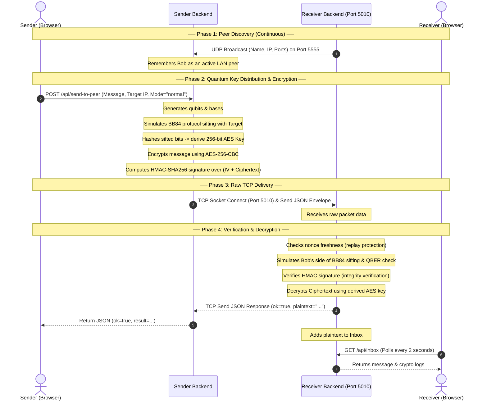

# QuantumHop: Secure P2P Network Simulation via BB84 QKD & AES-256

**QuantumHop** is a full-stack, secure, peer-to-peer (P2P) messaging application and simulation environment. It models quantum key distribution (QKD) using the **BB84 protocol** combined with **AES-256-CBC encryption**, **HMAC-SHA256 integrity verification**, and a robust suite of cryptographic defenses against eavesdropping, ciphertext tampering (Man-in-the-Middle), and replay attacks.

The project operates in two primary modes:
1. **Real Network Mode (LAN P2P):** Distributes messages across physical machines connected to the same Local Area Network (LAN) using UDP-based automatic peer discovery and direct raw TCP socket transmission.
2. **Local Simulation Mode:** Simulates a virtual 3-hop network pathway (`Sender -> Hop 1 -> Hop 2 -> Hop 3 -> Receiver`) on a single machine to visualize cryptographic states and attack mitigation in real-time.

---

## 📂 Project Directory Structure

Below is the directory structure of the QuantumHop project, detailing the responsibility of each file:

```text
multihop/
├── .gitignore               # Configures files ignored by Git (venv, node_modules, logs, etc.)
├── ELPPT.pptx               # Pr1esentation slide deck detailing the project's background and engineering
├── requirements.txt         # Global Python dependencies (Flask, Cryptography, PyTest, etc.)
├── run.bat                  # Orchestrator script to clean ports, install packages, and launch both servers
├── backend/                 # Python Flask & Raw TCP Socket backend
│   ├── __init__.py          # Marks backend as a Python package and initializes package exports
│   ├── app.py               # Flask REST API; serves the frontend and handles browser-to-socket requests
│   ├── attack_detector.py   # State machine for attack modes, target nodes, and packet check validations
│   ├── bb84.py              # BB84 Quantum Key Distribution simulator (qubit creation, measurement, sifting)
│   ├── config.py            # Global settings (ports, thresholds, timeouts, and IP helpers)
│   ├── crypto_utils.py      # AES-256-CBC encryption/decryption, PKCS7 padding, and HMAC integrity checks
│   ├── inbox.py             # Thread-safe in-memory store for messages, warnings, and route details
│   ├── logger.py            # Structured thread-safe event logger supporting dashboard telemetry
│   ├── node.py              # Generic hop handler; implements decryption, rekeying, and packet forwarding
│   ├── peer_discovery.py    # Multi-threaded UDP broadcast server (listening/announcing peers on the LAN)
│   ├── peer_socket.py       # Core P2P engine; drives raw TCP socket transmissions and processes envelopes
│   ├── receiver.py          # Final TCP server target for local simulation runs
│   ├── requirements.txt     # Sub-directory package dependencies
│   ├── router.py            # Routing table; manages node blocking/unblocking and hop selection
│   └── sender.py            # Prepares and encrypts packets, initiating local simulation runs
└── frontend/                # React (Vite) frontend application
    ├── index.html           # Single Page Application root template
    ├── package.json         # Frontend Node.js script commands and package dependencies
    ├── package-lock.json    # Exact lockfile for frontend package dependencies
    ├── vite.config.mjs      # Configuration for the Vite compiler and development proxy
    └── src/                 # Application codebase
        ├── App.jsx          # Root component; coordinates state, forms, UI tabs, and polling loops
        ├── main.jsx         # Mounts the React application tree into the HTML index file
        ├── styles.css       # Core design sheet styling the tabs, metrics, code panels, and terminal
        ├── api/
        │   └── client.js    # API Client interfacing with the Flask endpoints (fetch events, status, peers)
        └── components/
            ├── AttackControls.jsx # Controls local simulation attacks (eavesdropping, MITM, etc.)
            ├── ErrorRateBar.jsx   # Visual gauge tracking the calculated BB84 error rate vs. threshold
            ├── HopFlow.jsx        # Graphical multi-hop topology showing active and blocked routing hops
            ├── InboxPanel.jsx     # Lists inbox messages with full breakdown of cryptographic metadata
            ├── LiveLog.jsx        # Telemetry panel displaying real-time system logs and event traces
            ├── MetricCards.jsx    # High-level counters (messages sent, received, blocks, active status)
            ├── NodeSimulation.jsx # Simulates states and visual representation of individual nodes
            ├── PacketJourney.jsx  # Interactive stepper tracing packets through their cryptographic operations
            └── PeerList.jsx       # Displays active LAN peers discovered dynamically via UDP
```

---

## 🔐 Core Cryptographic & Quantum Concepts

QuantumHop combines classical cryptography with quantum key distribution logic to build an end-to-end secure channel.

### 1. The BB84 Protocol (Quantum Key Distribution)
Implemented in [bb84.py](file:///d:/NPS%20MULTIHOP/multihop-communication-system/backend/bb84.py), this module simulates a quantum fiber link exchanging polarized photons.
* **Qubit Generation:** Alice prepares random bits ($0$ or $1$) and encodes them using random bases: Rectilinear (`+`) or Diagonal (`x`).
* **Transmission & Measurement:** The photons are sent over a quantum channel. Bob measures them using his own randomly selected bases (`+` or `x`). 
* **Sifting:** Alice and Bob exchange their bases over a public classical channel. They discard all bits where their bases disagreed. The remaining bits form the **sifted key**.
* **Key Derivation:** A subset (sample size of $16$) is compared publicly to calculate the **Quantum Bit Error Rate (QBER)**. If QBER is below the threshold ($15\%$), they hash the remaining sifted bits using SHA-256 to create a secure, symmetric $256$-bit AES key.

### 2. Symmetric Encryption & Integrity Tagging
Implemented in [crypto_utils.py](file:///d:/NPS%20MULTIHOP/multihop-communication-system/backend/crypto_utils.py):
* **AES-256-CBC:** Once a shared key is established via BB84, plaintext is padded to a 16-byte block boundary using PKCS7 and encrypted using AES in Cipher Block Chaining (CBC) mode with a cryptographically secure random Initialization Vector (IV).
* **HMAC-SHA256:** To prevent tampering, an HMAC tag is generated by signing the concatenated `IV + Ciphertext` with the derived shared key. This ensures ciphertext integrity and authenticity.

---

## ⚙️ Architecture & Implementation

The application operates as a distributed system, combining web interfaces, broadcast-based routing, and low-level multithreaded networking.

### 1. Peer Discovery (UDP Broadcasting)
Dynamic discovery is handled in [peer_discovery.py](file:///d:/NPS%20MULTIHOP/multihop-communication-system/backend/peer_discovery.py):
* Upon startup, the backend spins up two background threads.
* **Broadcast Thread:** Periodically sends a UDP datagram to the LAN broadcast address (`255.255.255.255` on port `5555`) containing a JSON payload with its name, IP, and port numbers.
* **Listener Thread:** Binds to port `5555` and listens for incoming UDP broadcasts from other laptops. When a packet is received, the peer is added or refreshed in an active peer directory.
* **Stale Peer Pruning:** Peers are considered offline and removed from the active directory if no broadcast is received for more than $12$ seconds.

### 2. Peer-to-Peer Raw Sockets
Managed in [peer_socket.py](file:///d:/NPS%20MULTIHOP/multihop-communication-system/backend/peer_socket.py):
* Each laptop runs a multithreaded TCP server listening on port `5010`.
* When a user sends a message, a TCP connection is opened to the target peer. The sender creates a JSON packet envelope containing the encrypted payload, the derived AES key, a unique nonce, routing metadata, and the attack configuration.
* The receiver accepts the connection, runs the verification checks, decrypts the message, and registers it in the local inbox database.

### 3. Dual-Tab React Interface
Configured in [App.jsx](file:///d:/NPS%20MULTIHOP/multihop-communication-system/frontend/src/App.jsx):
* **Real Network Tab:** Displays online LAN peers, allows sending real secure messages (or simulating active attacks across laptops), and logs incoming messages.
* **Local Simulation Tab:** Orchestrates a local virtual circuit. Users can send packets and watch them hop from `node1 -> node2 -> node3 -> receiver`, observing encryption, decryption, and key exchange at each step.

---

## 🔄 Detailed Message Lifecycle & Protocol Flow

The sequence diagram below visualizes the execution flow of a message transfer under normal operation:



---

## 🛡️ Attack Simulation & Detection Rules

QuantumHop implements precise detection criteria for three specific attack behaviors:

| Attack Vector | Simulation Vector | Security Control | Trigger Criteria | Action Taken |
| :--- | :--- | :--- | :--- | :--- |
| **Eavesdropping** | Intercepts quantum channel and measures qubits in transit. | **QBER Check** | $QBER > 15\%$ | Key negotiation is aborted, transmission is blocked, and no ciphertext is decrypted. |
| **Man-in-the-Middle (MITM)** | Tampers with the ciphertext stream during routing. | **HMAC-SHA256 Integrity** | Calculated HMAC $\neq$ Recieved Tag | Ciphertext is rejected at the destination before decryption; sender message is blocked. |
| **Replay Attack** | Captures a valid encrypted envelope and resends it later. | **Nonce Cache** | Nonce exists in local tracking cache | Message is rejected immediately; receiver flags duplicate packet signature. |

### Cryptographic Details of Detections:
1. **Eavesdropping Detection:**
   According to quantum mechanics, measurement disturbs the system. When an eavesdropper (Eve) intercepts the quantum channel, she must measure the qubits. Since she does not know Alice’s bases, she guesses. This introduces a $25\%$ error rate on average for matching bases. Bob’s QBER check flags any error rate above the $15\%$ threshold (which accounts for natural line noise) as a security breach.
2. **MITM Detection:**
   If a MITM attacker flips even a single bit of the encrypted payload, the HMAC signature will change completely. When the receiver processes the packet, it runs an HMAC comparison:
   $$\text{HMAC}(K, \text{IV} \mathbin{\Vert} \text{Ciphertext}_{\text{modified}}) \neq \text{Tag}_{\text{original}}$$
   Because the attacker does not have the BB84-derived key, they cannot generate a valid tag matching the modified ciphertext.
3. **Replay Detection:**
   The receiver maintains an in-memory sliding window cache of recently processed transaction nonces. Each envelope carries a unique 32-character hexadecimal nonce. If an incoming packet's nonce matches an entry in the cache, the transaction is immediately rejected, protecting against replay attacks. Nonces are pruned after a Time-To-Live (TTL) of 60 seconds.

---

## 🚀 Running the Project

The project is designed to be easily executable on Windows environments.

### Running with Launcher Script
Execute [run.bat](file:///d:/NPS%20MULTIHOP/multihop-communication-system/run.bat) by double-clicking it or executing it in PowerShell/CMD:
```powershell
.\run.bat
```
The script performs the following operations:
1. Scans and kills any process binding to ports `5000` (Flask), `5010` (TCP socket), `5173` (Vite), and `5555` (UDP discovery) to prevent conflicts.
2. Verifies the presence of the Python virtual environment (`venv`).
3. Verifies or installs JavaScript dependencies (`npm install` inside `/frontend`).
4. Installs missing Python packages from `requirements.txt`.
5. Launches the Flask backend and Vite frontend in separate terminal windows.

### Setting Up Windows Firewall (For LAN P2P)
To communicate between multiple physical laptops on the same Wi-Fi/LAN, ports must be opened in the Windows Defender Firewall. Run the following commands in an **Administrator PowerShell** on each machine:
```powershell
# Open Flask API port
netsh advfirewall firewall add rule name="QuantumHop API" dir=in action=allow protocol=TCP localport=5000

# Open P2P TCP Socket port
netsh advfirewall firewall add rule name="QuantumHop Socket" dir=in action=allow protocol=TCP localport=5010

# Open UDP Discovery port
netsh advfirewall firewall add rule name="QuantumHop Discovery" dir=in action=allow protocol=UDP localport=5555
```
Once configured, running the application on multiple laptops will allow them to automatically discover each other under the **Real Network** peer list and swap securely encrypted messages.
